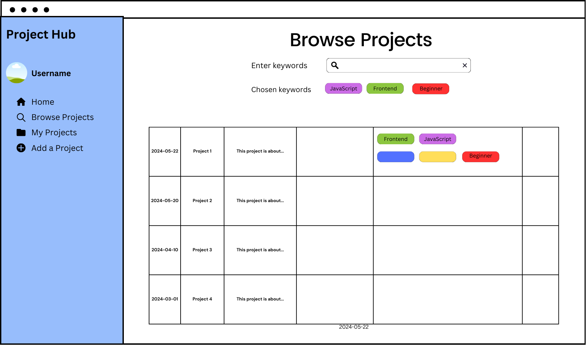
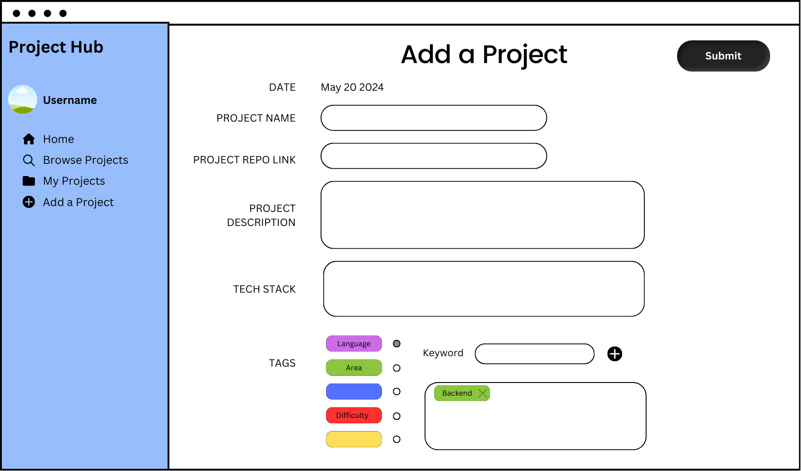

# Group 3 - Innovators

## Project Executive Summary

Repo Relay is a web app that connects developers looking to collaborate on unfinished coding projects. It provides a platform for users to publish, find, and contribute to projects, enhancing their technical skills, expanding their portfolios, and fostering a collaborative coding community.

## Team Members

- Nariman Muldashev: I am 2nd year BCS student with a prior background in consulting and finance. Currently completing a co-op at a Vancouver based fintech startup.
- Alexander Proskiw: Hi, I'm Alex! I'm in my final year of the BCS program, really excited to learn more about web development, and like fishing in my spare time.
- Chloe Van: I started the BCS program in 2022 after working as a pharmacist and am currently completing a co-op at a Toronto based fintech company.
- Kai Groden-Gilchrist: I'm in my final year of BCS - looking to transition from my background in high-throughput biology into software engineering!

## Project Description
Repo Relay is a web app designed for developers of all experience levels who have coding projects they cannot complete or who are looking for projects to build on. It provides a hub where users can publish, find, and collaborate on unfinished coding projects, allowing them to enhance their technical skills, expand their portfolio, and contribute to the coding community.

The app will store information about coding projects, including project goals, tasks completed, tasks to complete, difficulty, languages used, and details about the contributors. Users will be able to search for projects, view detailed project information, sign up for those projects they are interested in and keep track of ongoing projects.

Additional functionalities, such as a machine learning recommender system for project suggestions and deeper integration with the GitHub API, may be added based on time constraints.

## Project Task Requirements

### Minimal Requirements (3-5, will definitely complete)
1. As a user, I want to create a profile where I can identify my project preferences and technology skills, enabling me to have an identity and interact with the platform.
2. As a programmer with an unfinished coding project, I want to post a new project with all required information (project name, description, tasks completed, tasks remaining, tech stack, and difficulty level), making my project available for other community members to view and contribute to.
3. As a programmer looking to tackle a new project, I want to view all available projects in the database, so I can easily find and choose projects I want to contribute to.
4. As a project contributor, I want to update project information (project name, description, tasks completed, tasks remaining, tech stack, and difficulty level) as the project progresses, so that it accurately reflects the project state.
5. As a project contributor, I want to archive/delete an existing project when it is no longer feasible to work on, ensuring other community members don't accidentally contribute to it.

### Standard Requirements (3-7, will most likely complete)
1. As a user, I want to be able to search and filter projects based on various criteria, so that I can quickly locate projects that match my interests and skills.
2. As a project contributor, I want to be able to subscribe to projects I am interested in or intend to contribute to, so that these projects are tracked in my profile for better organization and follow-up.
3. As a user, I want to be able to use a colorful tag/hashtag system for categorizing work completed, work to complete, technologies used, and expected difficulty, so that I can rapidly visually identify key project characteristics.
4. As a contributor, I want to be able to chat with other people working on the same project and get notified of project changes, so that I can facilitate communication and collaboration.
5. As a user, I want to be able to authenticate with GitHub and retrieve more data on project repositories using the GitHub API, so that I can streamline the login process and access more detailed project information.

### Stretch Requirements (2-3, plan to complete at least 1!)
1. As a project contributor, I want to receive machine learning generated project recommendations based on my interests, profile information, and past contributions, so that I can easily find new projects that align with my preferences and skills.
2. As a project owner or contributor, I want to host code files directly on the website, so that I can easily collaborate and manage project files without relying on external services.
3. As a project contributor, I want to interact with gamification elements such as badges, leaderboards, and achievement tracking, so that I can be motivated and encouraged to participate more actively in the community.

## Project Task Breakdown

### Minimal Requirement Breakdown
**Minimal Requirement 2: Creating a new coding project.**
1. Design the front-end project creation page using React, ensuring it is responsive and accessible on different devices.
2. Create a form for users to enter project details with fields for project name, project repo, description, tasks completed, tasks remaining, tech stack, and difficulty level, including form validation and tooltips.
3. Implement backend validation of the project details using Node/Express to ensure data integrity and handle errors.
4. Set up an API endpoint with Node/Express to handle project creation requests and save the data to the MongoDB database.
5. After adding the project to the database, dynamically display the new project card on the front-end without needing a page refresh.

**Minimal Requirement 3: View all coding projects in the database.**
1. Create a projects collection in MongoDB with fields for project name, GitHub repo, description, and users subscribed to the project.
2. Set up an API endpoint using Node/Express to query the MongoDB collection for available projects, returning the data in JSON format.
3. Develop a React component to display the project list, querying the API endpoint to retrieve and render project data.
4. Apply styling to the project list using CSS or a styling library to ensure a clean and user-friendly presentation.

## Images

The rough sketch prototypes below show the key tasks of the app including viewing all available projects, and creating a new project.

### Project List Sketch

### Project Creation Sketch

## Describe your topic/interest in about 150-200 words
Our team chose to create Repo Relay because we recognize the common challenge developers face in completing coding projects. Many developers, whether beginners or seasoned professionals, often start ambitious projects but struggle to finish them due to time constraints, shifting priorities, or the need for specific expertise. Repo Relay aims to bridge this gap by providing a platform where these unfinished projects can find new contributors. This collaborative environment not only helps in completing these projects but also fosters learning and growth within the coding community, allowing developers to enhance their skills and expand their portfolios while contributing to meaningful projects.

## References
N/A

